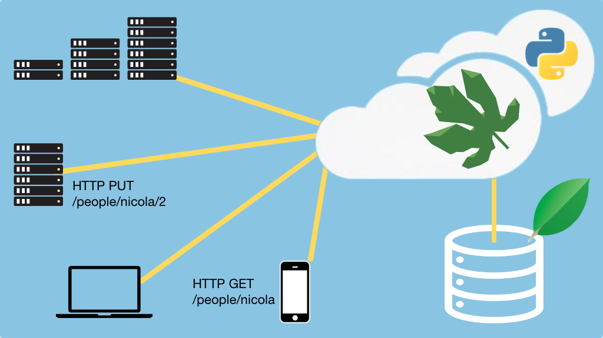

# Eve: Building RESTful APIs with MongoDB and Flask

## Course Summary

Eve is an open source Python REST API framework designed for human beings. It allows to effortlessly build and deploy highly customizable, fully featured RESTful Web Services.

## What's this course about and how is it different?

This course will teach you to effortlessly build RESTful services based on Flask and MongoDB.

We dive deep into every aspect of the Eve REST framework. After a quick introduction to MongoDB and Flask, we'll dig into Eve, build our schemas and endpoints and start serving HTTP clients right away, and that's just the beginning.

In this course, you will:

* Create a new Eve web service application
* Define data schemas for the service and MongoDB
* Issue queries from the client straight into the service
* Validate inbound data (including custom rules)
* Add and configure paging for large data sets
* Project responses for just the data you need
* Switch between JSON and XML per client request
* Secure your service with authentication
* Add event hooks such as pre-insert actions
* Limit the rate of your clients to avoid abuse
* Deploy your service
* And lots more

View the [course page](https://training.talkpython.fm/courses/explore_eve/eve-building-restful-mongodb-backed-apis-course?utm_source=github) for a full course outline.

